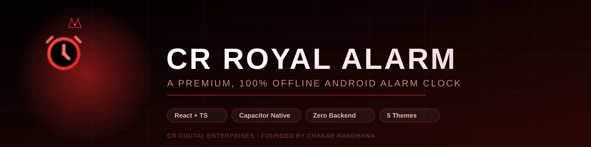
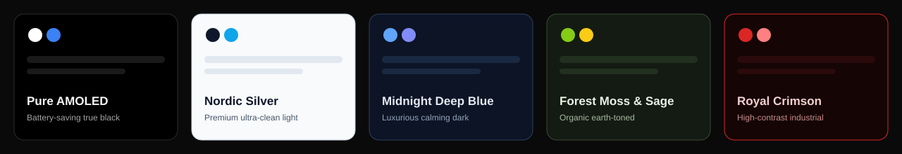

<div align="center">



<br/>

[](https://github.com/Chakar-Randhawa/CR-Royal-Alarm/actions)
[](https://react.dev)
[](https://www.typescriptlang.org)
[](https://capacitorjs.com)
[](#license)

**A premium, 100% offline Android alarm clock — no backend, no account, no internet.**
Every alarm, setting and theme choice lives entirely on the device.

[Features](#-features) · [Themes](#-themes) · [Tech Stack](#-tech-stack) · [Getting the APK](#-getting-the-apk) · [Project Structure](#-project-structure) · [Permissions](#-permissions)

</div>

<br/>

## ✨ Overview

**CR Royal Alarm** is a native-feeling Android alarm clock built entirely with a web stack —
**React + TypeScript** on the front end, shipped as a real Android app through **Capacitor**.
There is no server, no database, and no sign-in anywhere in the product: every alarm, every
setting, and every theme choice is written to the device's own local storage through a single
typed storage layer, so the app works exactly the same with the phone in airplane mode as it
does online.

It's built to feel like a paid, polished product rather than a demo — an animated founder
splash on first launch, a guided coach-mark tour of the dashboard, real Android permission
screens instead of fake toggles, and an audio-reactive ringing screen driven by a live
`AnalyserNode`, not a canned animation.

<br/>

## 🚀 Features

| | |
|---|---|
| ⏰ **Real exact alarms** | Scheduled through Capacitor's native `LocalNotifications`, with `SCHEDULE_EXACT_ALARM` / `USE_EXACT_ALARM` and boot-persistence — alarms survive a phone restart. |
| 🎵 **Custom song as alarm tone** | Pick any song from the phone's gallery, choose how much of it to use as the ringing clip (5s → full length), and it loops seamlessly until dismissed. |
| 📊 **Audio-reactive ringing screen** | The equalizer bars are driven by a real Web Audio `AnalyserNode` reading the actual tone or song that's playing. |
| 🧮 **Dismiss missions** | Math problems (fully generated & checked), device-shake detection, and a barcode-scanner mission to force you to actually wake up. |
| 🛡️ **Genuine system permissions** | "Display over other apps," "Unrestricted battery," and exact-alarm access open the *real* Android Settings screens via a custom native Capacitor plugin — not a fake green checkmark. |
| 🎨 **5 built-in themes** | From true-black AMOLED to a clean light theme — see [Themes](#-themes) below. |
| 🧭 **Guided first-run tour** | Coach-marks the real dashboard buttons (add alarm, quick nap, filters, sort) once, right after onboarding. |
| 💤 **Quick nap tiles** | One-tap short naps straight from the dashboard, no editor required. |
| 📴 **Fully offline** | Zero network calls. No backend, no accounts, no analytics — everything lives in local storage. |
| 🤖 **Automated APK builds** | Every push to `main` builds a signed-ready APK on GitHub's own runners — no Android Studio, no third-party CI. |

<br/>

## 🎨 Themes



Every theme is a fully-typed color palette (`src/lib/themes.ts`) applied live through
`ThemeContext` — including the Android status bar and navigation bar color, which switch
automatically between light and dark icon styles as you change themes.

<br/>

## 🛠️ Tech Stack

<table>
<tr>
<td valign="top" width="33%">

**Core**
- React 18 + TypeScript 5.5
- Vite 5
- Tailwind CSS 3

</td>
<td valign="top" width="33%">

**Native layer**
- Capacitor 8 (Android)
- `@capacitor/local-notifications`
- `@capacitor-community/keep-awake`
- Custom native Java plugin for permissions

</td>
<td valign="top" width="33%">

**In-house, zero extra deps**
- Web Audio API (tones + analyser)
- IndexedDB (custom song storage)
- `lucide-react` icon set

</td>
</tr>
</table>

<br/>

## 📂 Project Structure

```text
src/
  components/
    dashboard/     Dashboard, AlarmCard, QuickNapTiles
    editor/        AlarmEditor — create/edit alarm + mission & audio settings
    onboarding/    First-run permission walkthrough
    settings/      Theme + default alarm settings screen
    trigger/       Full-screen ringing UI (math / shake / scanner missions)
    ui/            Modal, Dropdown, Slider, Toggle, Toast
    icons/         Inline SVG icon set
  contexts/        ThemeContext (5 built-in themes)
  lib/
    storage.ts       single source of truth for all local storage reads/writes
    notifications.ts Capacitor LocalNotifications scheduling
    audio.ts          alarm tones, vibration patterns, TTS briefing
    themes.ts          theme color definitions
  types/           shared TypeScript types

android-assets/    notification icon + alarm sound + app icon, copied into
                   the native project automatically during the CI build
.github/workflows/build-apk.yml   builds the APK automatically on GitHub
```

> The `android/` native folder is **not** committed — it's generated fresh on every CI
> run from `capacitor.config.ts` + `android-assets/`. See `android-assets/README.md`.

<br/>

## 🔧 Running It Locally

```bash
npm install
npm run dev
```

Opens at `http://localhost:5173`. Alarm scheduling, vibration and native notifications only
work on an actual Android device or emulator via Capacitor — the web preview is for UI work
only.

<br/>

## 📦 Getting the APK

No Android Studio, no Java, no local setup required — GitHub builds it for you.

1. Push to `main` (or open the **Actions** tab and run the workflow manually)
2. Open the **Actions** tab → latest **Build Android APK** run
3. Wait for it to finish (5–10 minutes on a cold run)
4. Scroll to **Artifacts** → download **`cr-royal-alarm-debug-apk`**
5. Unzip → `app-debug.apk` → copy to your phone and install
   (Android will prompt you to allow "install unknown apps" the first time)

The debug APK is fully installable with Android's default debug signing key — fine for
personal use, not for the Play Store.

**Want a signed release build?** Add these four repository secrets under
**Settings → Secrets and variables → Actions**, and the workflow will also produce a
**`cr-royal-alarm-release-apk`** artifact on every push:

| Secret | Value |
|---|---|
| `ANDROID_KEYSTORE_BASE64` | Your `.keystore`/`.jks`, base64-encoded (`base64 -w0 your.keystore`) |
| `ANDROID_KEYSTORE_PASSWORD` | Keystore password |
| `ANDROID_KEY_ALIAS` | Key alias inside the keystore |
| `ANDROID_KEY_PASSWORD` | Key password |

No keystore yet?

```bash
keytool -genkeypair -v -keystore release.keystore -alias cr_royal_alarm \
  -keyalg RSA -keysize 2048 -validity 10000
```

Keep that file and its passwords safe — the same keystore is required for every future
update once the app is published.

<br/>

## 🔐 Permissions

| Permission | Why |
|---|---|
| `SCHEDULE_EXACT_ALARM` / `USE_EXACT_ALARM` | Alarms fire at the exact second set, not "roughly around" |
| `RECEIVE_BOOT_COMPLETED` | Alarms survive a phone restart |
| `WAKE_LOCK` | Wakes the device when an alarm fires |
| `VIBRATE` | Vibration patterns on ring |
| `SYSTEM_ALERT_WINDOW` | Real "display over other apps" for the ringing screen |
| `POST_NOTIFICATIONS` | Required on Android 13+ to show alarm notifications |
| `ACCESS_NOTIFICATION_POLICY` | Do-not-disturb bypass for alarms |
| `REQUEST_IGNORE_BATTERY_OPTIMIZATIONS` | Prevents Android from killing the app before an alarm fires |

<br/>

## ✅ What's Real vs. Simulated

| Feature | Status |
|---|---|
| Math dismiss mission | ✅ Fully real — generated & checked live |
| Shake dismiss mission | ✅ Real device-motion detection (falls back to a manual button in browser preview) |
| Overlay / battery / exact-alarm permissions | ✅ Fully real — backed by a custom native Capacitor plugin |
| Custom gallery song as tone | ✅ Fully real — real file picker, real persistent storage, real looping playback |
| Scanner dismiss mission | 🟡 UI only — a real camera scanner needs a native barcode plugin that isn't wired in; "Simulate Scan" stands in for it |
| Flashlight toggle in scanner mode | 🟡 Stored as a preference, not wired to a real flashlight plugin |

<br/>

## 📜 License

Proprietary — © CR Digital Enterprises. All rights reserved.

<br/>

<div align="center">

Built and maintained by **[Chakar Randhawa](https://cr-digital-enterprises.netlify.app)** · CR Digital Enterprises

</div>
